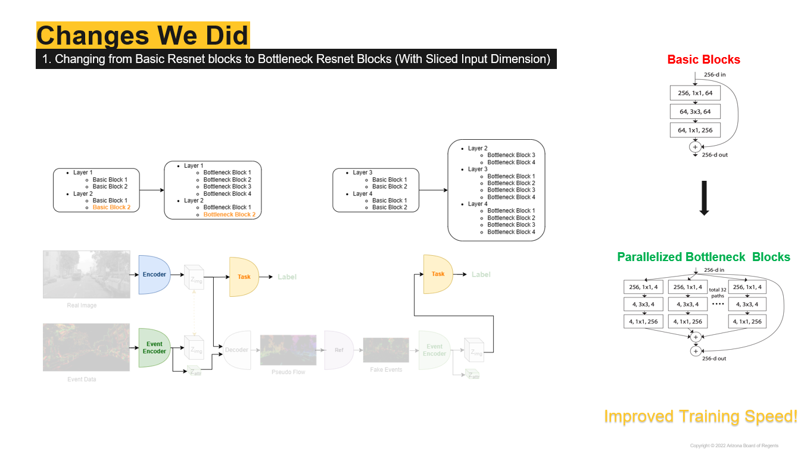
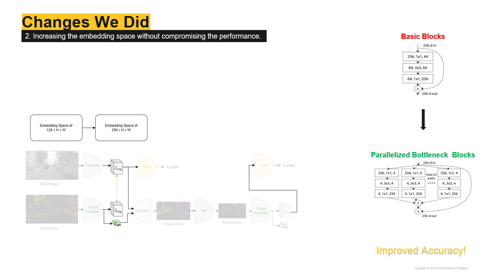
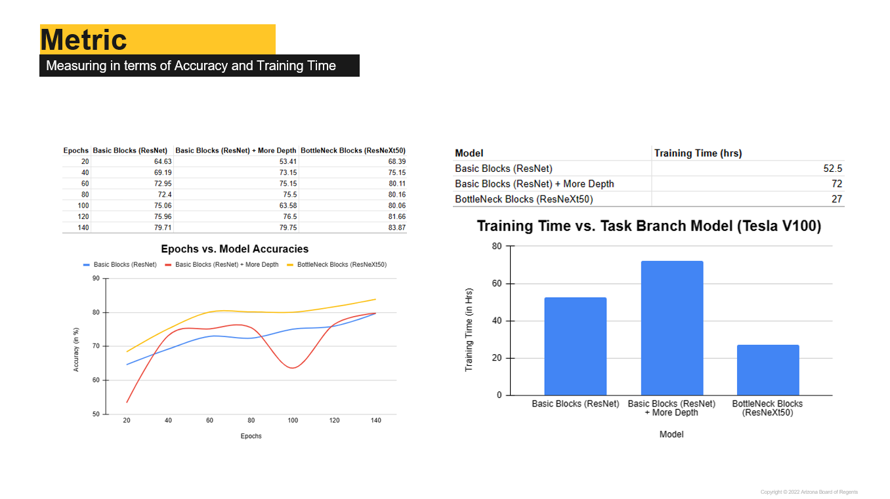

# Bridging the Gap between Events and Frames through Unsupervised Domain Adaptation

This code was initially created by the [UZG Perception Group](https://github.com/uzh-rpg/rpg_ev-transfer) for leveraging the labelled dataset in RGB space to be used for the event domain datasets.

We modifoed the codebase to use the ResNext50 based bottleneck blocks to make the training faster and improved the accuracy further for the classification task on N-Caltech101 Dataset. 

## Changes 




## Results

The graph in yellow shows the accuracy increase and the training time also got reduced to half compared to the baseline model.


## Installation
### Dependencies
If desired, a conda environment can be created using the followig command, remove the prefix if required.

```bash
conda env create -f environment.yml
conda env list
conda activate ev-cam <First line of the environment.yml>
```


## Datasets
### Caltech101 and N-Caltech101
The paired dataset containing Caltech101 and N-Caltech101 can be downloaded [here](https://rpg.ifi.uzh.ch/data/VID2E/Paired_N-Caltech101.zip)
The dataset should have the following format:


    ├── N-Caltech101                 # Path in settings.yaml is the directory of this folder
    │   ├── accordion                # Classes as folder names
    │   │   ├── cam0_events_0001.npy 
    │   └── ...
    ├── Caltech101
    │   ├── accordion
    │   │   ├── image_0001.jpg
    │   └── ...
    ├── split_train_0.5_val_0.25_test_0.25_new
    │   ├── test.txt
    │   ├── train.txt
    │   └── val.txt
    ├── split_train_0.5_val_0.25_test_0.25_new_extended
    │   ├── test.txt
    │   ├── train.txt
    │   └── val.txt
   
As our method does not require paired frame and event data, the extened caltech101 can be used.


## Training
The settings for the training should be specified in `config/settings.yaml`.
To start the training, it is necessary to replace `<path>` everywhere in the yaml file. 
If the dataset is not used, the path can also be replaced by `None`.

Two different models can be trained:
- classification_model: standard transfer model for the classification task
- object_det_model: transfer model for the object detection task

The following command starts the training: 

```bash
CUDA_VISIBLE_DEVICES=<GPU_ID>, python train.py --settings_file <path of settings file>
```

The following command starts the evaluation:

```bash
python -m evaluation.ncaltech101_evaluation --settings_file <path of settings file> --checkpoint_file <path of checkpoint file>
```

# Acknowledgement
The general architecture was inspired by:<br />
<https://github.com/uzh-rpg/rpg_ev-transfer>
```bibtex
@InProceedings{Messikommer20ral,
  author        = {Nico Messikommer and Daniel Gehrig and Mathias Gehrig and Davide Scaramuzza},
  title         = {Bridging the Gap between Events and Frames through Unsupervised Domain Adaptation},
  journal       = {Robotics and Automation Letters. (RA-L)},
  url           = {http://rpg.ifi.uzh.ch/docs/RAL22_Messikommer.pdf},
  year          = 2022
}
```